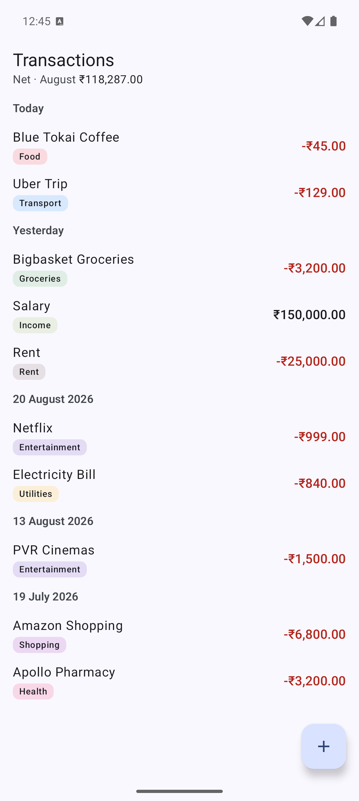
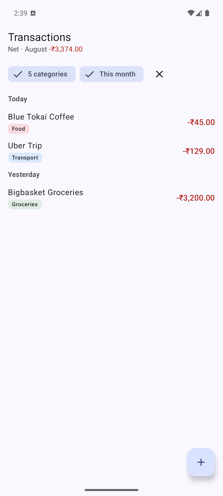
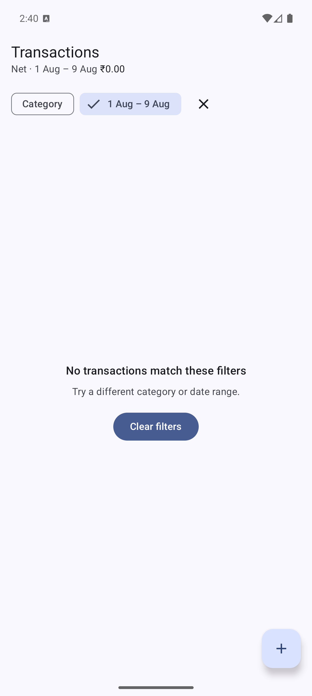
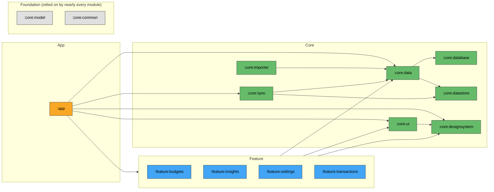

# Bahi

An offline-first personal finance tracker for Android. Import a bank statement, get it categorised, track it against a budget — with everything readable and editable with no network, and row-level sync when there is one.

Named after the *bahi khata*, the traditional Indian ledger book.

> **Status:** M0 (scaffolding) complete. See [Roadmap](#roadmap).

---

## Why this repo exists

Most of my production Android work — mobile banking on the Backbase platform, a subscription-commerce app with 100K+ DAU — is closed source. This repo is where the architectural decisions behind that work are visible: module boundaries enforced by the build, migrations that are tested rather than hoped for, and a data layer that treats the network as an optimisation rather than a prerequisite.

Two problems here are genuinely hard and get the most attention:

1. **CSV import** — inferring column mappings across bank exports that disagree about column order, date format, debit sign convention, and whether the file even starts with a header row.
2. **Sync conflict resolution** — per-field resolution, because last-write-wins on a whole row silently discards a category the user set on their phone while their tablet was offline.

<p align="center">
  
  
  
</p>
---

## Architecture

Three layers, fifteen modules. Features never depend on other features; the build fails if they try.



This is a simplified view: `:core:model`, `:core:common` and `:core:testing` are omitted as edge targets, because nearly every module in the project depends on them and drawing all of those edges would just redraw the hairball this diagram exists to avoid. `:core:model` and `:core:common` are shown once, as the foundation layer everything else sits on; `:core:testing` is a test-only dependency of almost every module and isn't shown at all.

The full graph -- every module, every edge, no omissions -- is generated from the build, not drawn by hand:

```bash
./gradlew moduleGraph   # writes build/reports/module-graph.md
```

This simplified diagram is derived from that same generated data (`renderSimplifiedGraph` in the root `build.gradle.kts`), then copied here by hand -- it can't be injected into the README automatically, so re-run `moduleGraph` and re-paste after a dependency change. The full graph lives in `build/reports/module-graph.md` alongside it.

### Decisions worth explaining

**`:core:model` and `:core:common` are pure Kotlin JVM modules.** No Android dependency at all. Their tests run in milliseconds, and the layering boundary is enforced by the compiler rather than by discipline.

**Money is `Long` minor units, never `Double`.** `Money` is a value class wrapping paise/cents. Floating-point drift in a finance app is a correctness bug, and this makes it unrepresentable rather than merely unlikely. `Money.parse` handles the formats real bank CSVs actually emit — parentheses for negatives, European separators, Indian digit grouping, currency symbols.

**No `fallbackToDestructiveMigration()`.** Silently wiping a user's financial history on a schema change is not an acceptable failure mode. Schemas are exported to `core/database/schemas/` and committed; CI fails if a schema changes without being committed alongside its migration and test.

**Soft deletes with tombstones.** Sync needs to know that a row was deleted, not just that it stopped existing.

**Content hashing for import de-duplication.** Re-importing an overlapping statement must not create duplicates. The hash deliberately excludes id, category and notes, so a row the user has already categorised is still recognised as the same row.

**Convention plugins, not copy-pasted build files.** JVM target, compile SDK, Compose setup and test dependencies are defined once in `build-logic/` and applied as `bahi.android.feature` etc. Changing the JVM target changes it for all fifteen modules.

---

## Testing

| Layer | What's covered | Where |
|---|---|---|
| Pure Kotlin | `Money` parsing across real bank CSV formats | `core/model/src/test` |
| Data | Repository behaviour against fakes, not mocks | `core/data/src/test` |
| Room | Migrations run against the previous schema | `core/database/src/androidTest` |
| ViewModel | State emission with Turbine + `TestDispatcher` | `feature/*/src/test` |
| Compose | Screen states driven from the stateless composable | `feature/*/src/androidTest` |
| Build | Feature-to-feature dependencies fail the build | `./gradlew checkModuleBoundaries` |

Fakes over mocks throughout. A mock verifies that a call happened; a fake lets the test assert on observable behaviour, which is what actually breaks in production.

Run the full suite with `./gradlew unitTests` -- not `testDebugUnitTest`. `:core:model` and `:core:common` are pure-JVM modules with a `test` task, not `testDebugUnitTest`, so the Android-only command silently skips them.

---

## Getting started

Requires JDK 17 and Android Studio (Ladybug or newer).

```bash
git clone https://github.com/<you>/bahi.git
cd bahi
./gradlew assembleDebug
./gradlew unitTests
```

The Gradle wrapper JAR is not committed in this scaffold. Generate it once with:

```bash
gradle wrapper --gradle-version 8.14.2
```

---

## Roadmap

- [x] **M0** — Module structure, convention plugins, CI, Room schema + migration test harness
- [ ] **M1** — Transaction CRUD, categories, list and detail screens
- [ ] **M2** — CSV import: column-mapping inference, preview, de-duplication
- [ ] **M3** — Budgets and rule-based auto-categorisation
- [ ] **M4** — Row-level sync with per-field conflict resolution
- [ ] **M5** — Insights, baseline profile, Macrobenchmark startup numbers

---

## License

MIT
