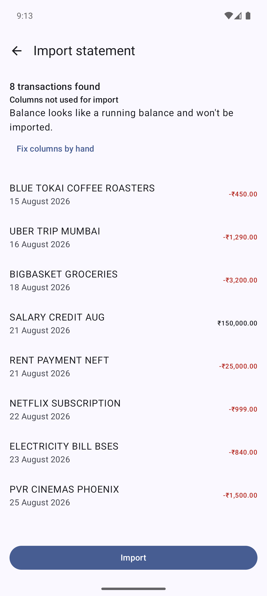
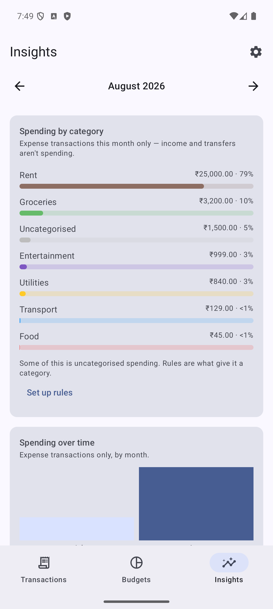
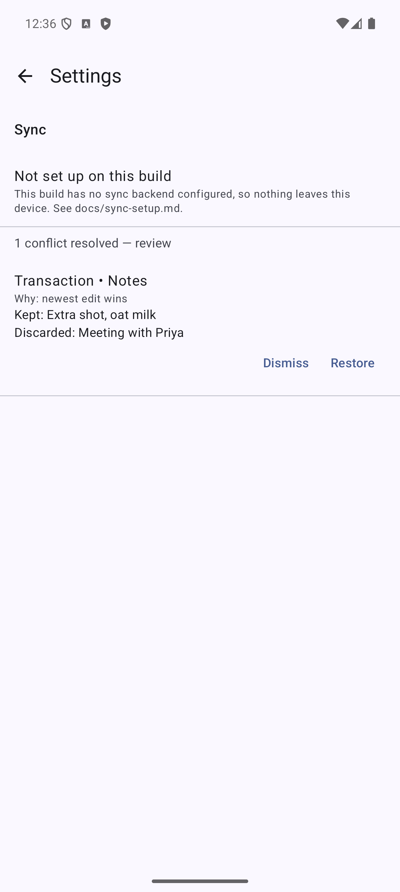
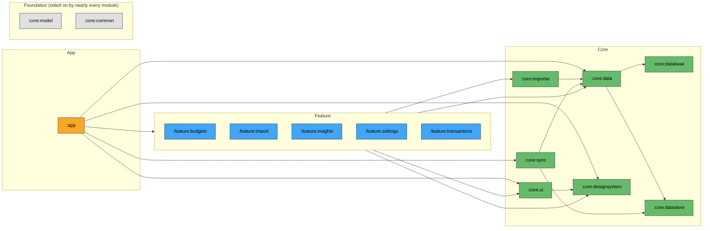

# Bahi

[](https://github.com/CharanjeevSingh1/bahi/actions/workflows/ci.yml)

An offline-first personal finance tracker for Android. Import a bank statement, get it categorised, track it against a budget, see where the money went — everything readable and editable with no network, and row-level sync when there is one.

Named after the *bahi khata*, the traditional Indian ledger book.

<p align="center">
  
  
  
  
</p>

See [Roadmap](#roadmap) for what's built, [Testing](#testing) for how it's checked, and the [design documents](#design-documents) for why it's built this way.

---

## Why this repo exists

Most of my production Android work — mobile banking on the Backbase platform, a subscription-commerce app with 100K+ DAU — is closed source. This is where the architectural decisions behind that work are visible on a real, running app: module boundaries enforced by the build rather than by convention, migrations that are proven by watching them fail, and a data layer that treats the network as an optimisation rather than a prerequisite.

That discipline is also enforced on this repo's own development, not just claimed about it: [`CLAUDE.md`](CLAUDE.md) is the actual contract every change here is held to — the architecture rules above are copied from it verbatim — and [`prompts/`](prompts/) holds the milestone-by-milestone prompts this repo was built from, if you'd rather read the instructions than take the result on faith.

---

## The two problems this repo is built to argue about

Everything else here — the screens, the modules, the CI — exists in service of two problems that are actually hard, and both are fully built now.

**CSV import** is inference under disagreement. Bank exports disagree about column order, date format, debit sign convention, and whether the file even has a header row — and getting it wrong doesn't crash, it silently produces a plausible-looking wrong answer, which is worse. The engine treats every column role as an independently-inferable signal (date, amount, debit/credit vs. running balance, description), and it declines to guess, rather than pick a side, wherever more than one of those signals is left standing: a date genuinely ambiguous under both `dd/MM` and `MM/dd`, an amount column whose sign can't be pinned to a balance column, a debit/credit pair whose roles don't resolve from the header, and three or more money-shaped columns at once (a documented gap, not a misclassification). [`docs/csv-import-design.md`](docs/csv-import-design.md) has the full inference design, including a de-duplication bug found and fixed while writing it down.

**Sync conflict resolution** is what happens when two offline devices both edited overlapping state and now have to agree, with no server and no bank to defer to. Last-write-wins on a whole row silently discards the category a user set on their phone while their tablet was offline editing the same transaction's notes; this resolves per field, against a stored merge base, and keeps a record of what it discarded so a wrong resolution is recoverable rather than silently gone.

The engine, resolver, and a two-device convergence suite are proven with no network (M4a); a Google Drive transport, OAuth, end-to-end encryption, and the periodic worker that gives the engine its first real caller carry that resolution between devices, with a Settings screen that surfaces a real conflict — by category name, not a raw id — and restores a discarded value (M4b). [`docs/sync-design.md`](docs/sync-design.md) has the full design, including two real bugs the convergence suite found in already-committed code and a plain statement of what still hasn't run against a real Drive account (see [Roadmap](#roadmap)).

---

## Design documents

The three documents linked above are the strongest artifacts in this repo, and the thing that makes them worth opening isn't the decisions — it's that each one argues with itself. They keep rejected alternatives next to the reasoning that rejected them, name the near-misses that would have shipped a subtle bug (a `NULL`-uniqueness trap in the budgets schema, a merge-base rebase that a plain `+ 1` silently breaks), and correct their own earlier claims in place rather than quietly editing history — a nine-run measurement in `docs/budgets-design.md` §2.2 is shown, then re-measured at 22 runs, then shown to have been wrong in both directions the first time.

- [`docs/csv-import-design.md`](docs/csv-import-design.md) — column-mapping inference, the preview/correction flow, and a presence-vs-count de-duplication bug that was live in already-committed code.
- [`docs/budgets-design.md`](docs/budgets-design.md) — rule-based auto-categorisation with a category lock enforced in two independent layers, budget scope, and the torn-frame race a nine-run sample called wrong.
- [`docs/sync-design.md`](docs/sync-design.md) — per-field merge against a shadow copy, the two-device convergence suite, the Drive transport, and an explicit answer to "has this run against a real Drive account" (no).

Two shorter documents support the sync design rather than arguing a case of their own: [`docs/sync-manual-test-plan.md`](docs/sync-manual-test-plan.md) (the two-emulator manual script) and [`docs/sync-setup.md`](docs/sync-setup.md) (what a real Google Cloud project would need to close the real-Drive-account gap).

---

## Architecture

Three layers, sixteen modules. Features never depend on other features; the build fails if they try.



This is a simplified view: `:core:model`, `:core:common` and `:core:testing` are omitted as edge targets, because nearly every module in the project depends on them and drawing all of those edges would just redraw the hairball this diagram exists to avoid. `:core:model` and `:core:common` are shown once, as the foundation layer everything else sits on; `:core:testing` is a test-only dependency of almost every module and isn't shown at all.

The full graph — every module, every edge, no omissions — is generated from the build, not drawn by hand:

```bash
./gradlew moduleGraph   # writes build/reports/module-graph.md
```

This simplified diagram is derived from that same generated data (`renderSimplifiedGraph` in the root `build.gradle.kts`), then copied here by hand — it can't be injected into the README automatically, so re-run `moduleGraph` and re-paste after a dependency change. The full graph lives in `build/reports/module-graph.md` alongside it.

### Decisions worth explaining

**`:core:model` and `:core:common` are pure Kotlin JVM modules.** No Android dependency at all. Their tests run in milliseconds, and the layering boundary is enforced by the compiler rather than by discipline.

**Money is `Long` minor units, never `Double`.** `Money` is a value class wrapping paise/cents. Floating-point drift in a finance app is a correctness bug, and this makes it unrepresentable rather than merely unlikely. `Money.parse` handles the formats real bank CSVs actually emit — parentheses for negatives, European separators, Indian digit grouping, currency symbols.

**No `fallbackToDestructiveMigration()`.** Silently wiping a user's financial history on a schema change is not an acceptable failure mode. Schemas are exported to `core/database/schemas/` and committed; CI fails the push if the exported schema doesn't match what's committed, and separately, `MigrationTest` fails if a version bump isn't backed by a real migration in `Migrations.ALL` — there's no way to bump the schema version without both.

**Soft deletes with tombstones.** Sync needs to know that a row was deleted, not just that it stopped existing.

**Content hashing for import de-duplication.** Re-importing an overlapping statement must not create duplicates — and, subtler, two genuinely identical transactions in one batch must not be mistaken for a re-import of each other. The check is count-aware (how many of this hash already exist vs. how many just arrived), not presence-aware, precisely because presence-only filtering drops legitimate duplicates the moment a batch overlaps a previous import. `docs/csv-import-design.md` §4 has the failure case that motivated it.

**Convention plugins, not copy-pasted build files.** JVM target, compile SDK, Compose setup and test dependencies are defined once in `build-logic/` and applied as `bahi.android.feature` etc. Changing the JVM target changes it for all sixteen modules.

---

## Testing

The short version: nothing here is trusted because it was written carefully. Each layer is trusted because something was deliberately broken and the tests caught it, or because a claim about behaviour was re-measured until it stopped being a guess.

- **Migration testing was meaningless until M2, and that's stated rather than hidden.** `Migrations.ALL` was an empty array for the entire M0/M1 lifetime, so `MigrationTest` was validating schema version 1 against itself — zero real migrations ever ran. The first schema change (`importBatchId`, `docs/csv-import-design.md` §11.1) was deliberately built specifically to give that test harness something real to prove, rather than leaving the gap between "migrations are tested" and "a migration test has ever run" open. There are seven schema versions now (`core/database/schemas/`), six real migrations, each with its own `MigrationTest` case.
- **The convergence property test was verified by making it fail.** `ConvergencePropertyTest` runs random operation orderings across two real `SyncEngine`s and asserts they converge. To check the assertion actually means something, the Lamport-style revision rebase it depends on was deliberately reverted to a plain `+ 1` — and the test caught it: 41 of the 50 seeded runs failed, each with a concrete dropped edit and a reproducible seed. (A separate deliberate breakage — making one field's merge policy asymmetric — did *not* reproduce as a convergence failure, which `docs/sync-design.md` §13 records as a real limit on what this test catches, not a success.) It runs 50 fixed seeds on every push (`ci.yml`) and 1,000 random seeds nightly (`nightly.yml`), because a rare interleaving deserves more attempts than every push can afford to block on.
- **A nine-run sample was wrong, and the fix was to run it more, not to trust it less.** `BudgetTotalsTransientTest` measures a real race: two queries that partition one month's spending are invalidated by the same write but re-query independently, so a UI frame can briefly see the transaction counted twice or not at all. Nine runs all landed the same way, and "it can only ever overstate, never lose money" went into a code comment and the design doc as fact. Re-measured at 22 instrumented runs, both shapes occurred in both directions, roughly half the time each. `CLAUDE.md`'s testing conventions now say this as a rule, not just a story: *a measurement over N runs is a sample, not a property* — state the run count wherever the claim appears.
- **Fakes, not mocks, everywhere.** A mock verifies a call happened; a hand-written fake lets a test assert on behaviour, which is what actually breaks in production. No MockK or Mockito dependency exists in this repo to reach for instead.
- **What genuinely isn't verified by an automated test is named, not implied.** `DriveTransportContractTest` runs the same contract suite `InMemoryFakeDrive` runs, against a real Drive account — but only when `core/sync/drive-test.properties` (gitignored) exists, so on a fresh clone it isn't run, it isn't even *compiled*. No credentials exist in this environment. `docs/sync-design.md` states plainly that sync has proven convergence and encryption against `InMemoryTransport` and an in-memory fake Drive, and that no real Google account has exercised any of it end to end — see [Roadmap](#roadmap).

| Layer | What's covered | Where |
|---|---|---|
| Pure Kotlin | `Money` parsing across real bank CSV formats | `core/model/src/test` |
| Data | Repository behaviour against fakes, not mocks | `core/data/src/test` |
| Room | Migrations run against the previous schema, not just the latest one | `core/database/src/androidTest` |
| Import inference | Column-mapping inference against real-world CSV fixtures (ambiguous dates, no header, mixed amount formats) | `core/importer/src/test` |
| Sync convergence | Two real `SyncEngine`s, two real Room databases, one in-process transport — every scripted conflict scenario plus the property test over random operation orderings | `core/sync/src/androidTest` |
| Drive transport (manual) | `DriveTransportContractTest` against a real Google Drive account — not run in CI, no credentials in this environment | `./gradlew :core:sync:driveTest`, [`docs/sync-setup.md`](docs/sync-setup.md) |
| ViewModel | State emission with Turbine + `TestDispatcher` | `feature/*/src/test` |
| Compose | Screen states driven from the stateless composable | `feature/*/src/androidTest` |
| Build | Feature-to-feature dependencies fail the build | `./gradlew checkModuleBoundaries` |

Run the full suite with `./gradlew unitTests` — not `testDebugUnitTest`. `:core:model` and `:core:common` are pure-JVM modules with a `test` task, not `testDebugUnitTest`, so the Android-only command silently skips them.

---

## Getting started

Requires Android Studio (Ladybug or newer). CI builds against JDK 17; JDK 21 also works locally. JDK 26 does not.

```bash
git clone https://github.com/CharanjeevSingh1/bahi.git
cd bahi
./gradlew assembleDebug
./gradlew unitTests
```

---

## Milestones

- [x] **M0** — Module structure, convention plugins, CI, Room schema + migration test harness
- [x] **M1** — Transaction CRUD, categories, list and detail screens
- [x] **M2** — CSV import: column-mapping inference, preview, de-duplication
- [x] **M3** — Budgets and rule-based auto-categorisation
- [x] **M4a** — Row-level sync, the convergence engine: per-field merge against a stored base, proven by running two engines over two databases and a fake transport in one process. No network. [`docs/sync-design.md`](docs/sync-design.md)
- [x] **M4b** — The transport that carries M4a's operations between devices: Google Drive as an encrypted append-only op log, OAuth, an elected-compactor step, and the periodic worker that gives `SyncEngine` its first real caller. Everything is proven against `InMemoryTransport`/an in-memory fake Drive, the same way M4a proves convergence with no network — **no real Drive account has run this app yet**, stated plainly rather than left to be inferred. [`docs/sync-design.md`](docs/sync-design.md)
- [x] **M5** — Insights: category breakdown, spending trend, over-budget list (`:feature:insights`)
- [ ] **M6** — Baseline profile and Macrobenchmark startup numbers

---

## License

MIT
